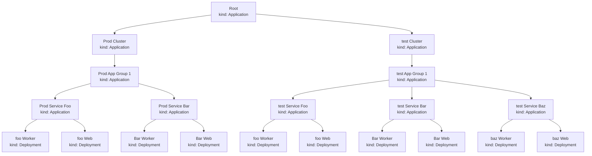

# Welcome to `mani-diffy`'s demo

Let's demonstrate how `mani-diffy` can be used to compare rendered charts before they are merged and deployed.

# Directory structure

This directory is a example of a repository structure that used to implement the [App of Apps pattern](https://argo-cd.readthedocs.io/en/stable/operator-manual/cluster-bootstrapping/#app-of-apps-pattern) with Argo CD.

Let's take a tour ...

```
├── README.md
├── bootstrap
│   ├── prod-cluster.yaml
│   └── test-cluster.yaml
├── charts
│   ├── app-of-apps
│   └── service
├── overrides
│    ├── app-of-apps
│    ├── bootstrap
│    └── service
└── .zz.auto-generated
    ├── hashes.json
    ├── prod-app-group-1
    ├── prod-cluster
    ├── prod-service-bar
    ...
    └── test-service-foo
```

## `bootstrap`

In the `bootstrap` directory you can find the ArgoCD applications that serve as the root of our tree of app of apps.
This directory is the entry point for `mani-diffy`, it's where `mani-diffy` looks first to find its way to rendering all the other charts before they get to Argo CD, so you can review changes safely.

## `charts`

In the `charts` directory you can find all the charts that are needed in our project.
In this example we only have 2 charts.
1. `app-of-apps` a chart that when rendered produces manifests files containing Argo application
2. `service` a chart that when rendered produces manifests files containing k8s resources needed for a service to run (ex: `kind: Deployment`)

## `overrides`

The `overrides` directory contains values needed to render the charts. 
These values are key to the app of apps pattern, indeed it's in the overrides that we define which apps run in which cluster and how many pods we'll be running per service and environment. 

## `.zz.auto-generated`

The `.zz.auto-generated` directory is the output dir for `mani-diffy`.
This is where the rendered manifests that represent the state of the world are kept.
When a user makes a change, `mani-diffy` will render the new manifests and commit them making the difference easy to review on a pull request. 
When `mani-diffy` runs for the first time it will create this dir and add rendered manifests to it.


# What's in the demo ?

We have 2 environments (test and prod) and an "app-of-apps" Chart used to create multiple layers of Argo CD applications.

- 1st layer: we have one Argo app for each cluster (ex: `prod-cluster.yaml`)
- 2nd layer: for each cluster, we have one or many app groups. An app group is a way to logically separate services.
- 3rd layer: for each app group, we have a few services. A service is a set of k8s resources that together are all we need for the service to be running (deployments, configmaps etc).

When the manifests have been generated, you can see all the output in `.zz.auto-generated/`.

Notice that there is one more app running in the test cluster: `test-baz-app`.



# See it in action

Submit a PR where you make a change to the overrides and you'll see the [Github action]( [README](../../.github/workflows/generate-manifests-demos.yaml)) add a commit to your PR with the resulting changes.


